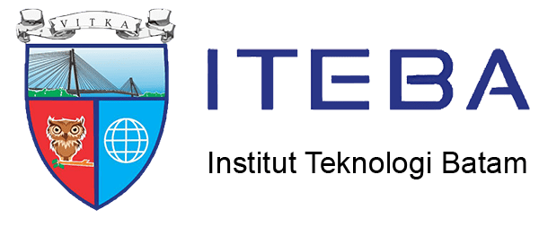

# Tugas Besar Komunikasi Data Kelompok 2

### Anggota: 1. Raja Muhammad Fikri (1822013) 2. Farhan Ghulam (1822014) 3. Hani Khairiyah (1922001) 

 

# __WifiSignalAnalysis__
Analisa jaringan adalah suatu proses mengumpulkan dan menganalisa data-data yang ada dalam lalu lintas jaringan. Tujuannya tidak lain untuk memaksimalkan seluruh sumber daya yang ada pada jaringan komputer tersebut. Cara kerja dari perangkat ini adalah memindai kekuatan sinyal Wi-Fi dalam bentuk dBM yang ditangkap oleh perangkat NodeMCU Esp-8266 yang selanjutnya akan mengirimkan notifikasi ke Telegram melalui services BotFather.

# Nama Bot Telegram 
@TugasBesarKOMDAT_bot
